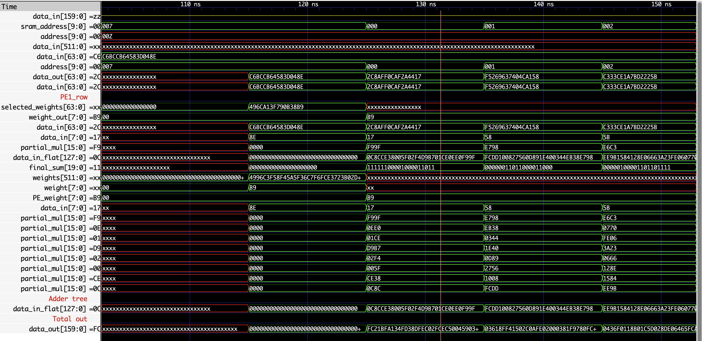

# 🧐 Vector Multiplier Design on Xilinx FPGA

## Introduction

이 프로젝트는 **Adder Tree 기반 Vector Multiplier**를 **Xilinx FPGA**에서 구현하는 것을 목표로 합니다. 이 Vector Multiplier는 pipelining 없이 1x64 Processing Element(PE)를 사용하여 벡터 곱을 수행하며, 한 줄의 출력을 생성하는 구조로 설계되었습니다. 해당 설계는 **TPU v1 아키텍처**에서 사용하는 Systolic Array와 비교될 예정입니다. 본 프로젝트는 Verilog로 구현되었으며, Xilinx Vivado 툴을 통해 합성과 FPGA 배치를 수행합니다.

### 주요 목표
- **Adder Tree 기반 설계**: pipelining 없이 Adder Tree를 활용하여 병렬적으로 곱셈 연산을 수행하는 Vector Multiplier 구조 구현
- **FPGA 최적화**: Xilinx FPGA에서 효율적으로 동작할 수 있도록 최적화된 설계
- **Systolic Array와 비교**: TPU v1 아키텍처의 Systolic Array 구조와 성능 및 자원 효율성을 비교하여 평가

### 프로젝트 구성 요소
- **Verilog 모듈 설계**: Vector Multiplier 구현에 필요한 주요 구성 요소를 모듈화
- **시뮬레이션 및 검증**: Icarus Verilog와 GTKWave를 활용하여 기능 검증 및 파형 분석
- **Python 기반 데이터 생성**: 입력 벡터 및 가중치 벡터 자동 생성 스크립트 제공

이 프로젝트는 **종합설계 과목**의 일환으로, Xilinx FPGA에서 Vector Multiplier를 구현하고, Systolic Array와의 비교를 통해 성능을 분석하는 것을 목적으로 합니다.
https://github.com/dudududukim/basic_systolic_array_HDL

#### Waveform Preview
